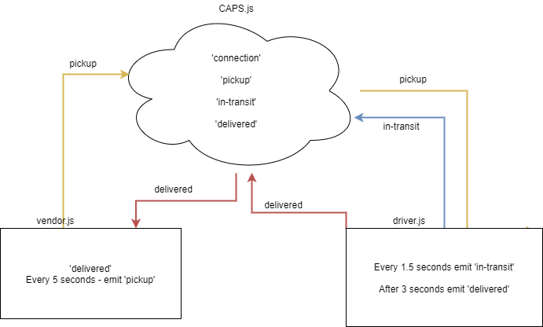

# CAPS

### Author: Mark Duenas

[Test Reports](https://github.com/MarkDuenas/socket-io-driver/actions)

[Pull Req](https://github.com/MarkDuenas/socket-io-driver/actions)

## Set up

Node.js installed

### Running the app

- npm i (bring in dependencies)
  - socket.io
  - socket.io-client
  - jest
  - faker
- npm start

### Tests

- Server Tests: `npm run test`

### UML

